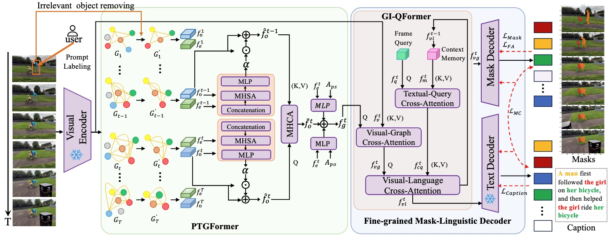

### 
Scene Graph-guided SegCaptioning Transformer with Fine-grained Alignment for Controllable Video Segmentation and Captioning
 

  Xu&nbsp;Zhang</a> <b>&middot;</b>
  Jin&nbsp;Yuan</a> <b>&middot;</b>
  Binhong&nbsp;Yang</a> <b>&middot;</b>
  Xuan&nbsp;Liu</a> <b>&middot;</b>
  Qianjun&nbsp;Zhang</a> <b>&middot;</b>
  Yuyi&nbsp;Wang</a> <b>&middot;</b>
  Zhiyong&nbsp;Li</a> <b>&middot;</b>
  Hanwang&nbsp;Zhang</a>
     

### Abstract
Recent advancements in multimodal large models have significantly bridged the representation gap between diverse modalities, catalyzing the evolution of video multimodal interpretation, which enhances users' understanding of video content by generating correlated modalities. However, most existing video multimodal interpretation methods primarily concentrate on global comprehension with limited user interaction. To address this, we propose a novel task, Controllable Video Segmentation and Captioning (SegCaptioning), which empowers users to provide specific prompts, such as a bounding box around an object of interest, to simultaneously generate correlated masks and captions that precisely embody user intent. An innovative framework Scene Graph-guided Fine-grained SegCaptioning Transformer (SG-FSCFormer) is designed  that integrates a Prompt-guided Temporal Graph Former to effectively captures and represents user intent through an adaptive prompt adaptor, ensuring that the generated content well aligns with the user’s requirements. Furthermore, our model introduces a Fine-grained Mask-linguistic Decoder to collaboratively predict high-quality caption-mask pairs using a Multi-entity Contrastive loss, as well as provide fine-grained alignment between each mask and its corresponding caption tokens, thereby enhancing users' comprehension of videos. Comprehensive experiments conducted on two benchmark datasets demonstrate that SG-FSCFormer achieves remarkable performance, effectively capturing user intent and generating precise multimodal outputs tailored to user specifications.

## SG-FSCFormer model

### Update
2025.9 Init repository.

### TODO List
- [ ] Code release. 
